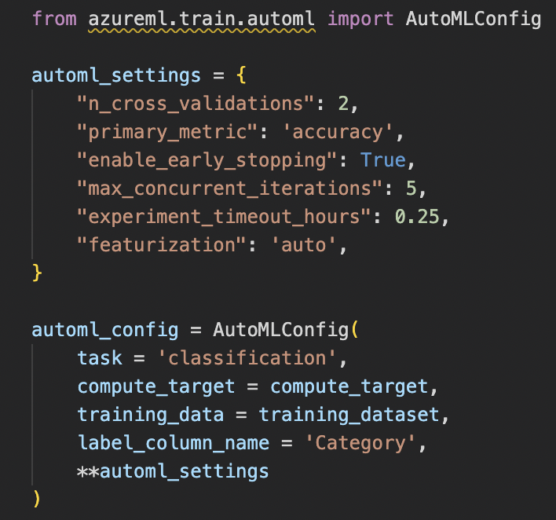
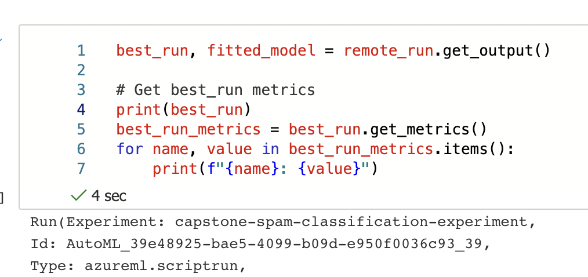
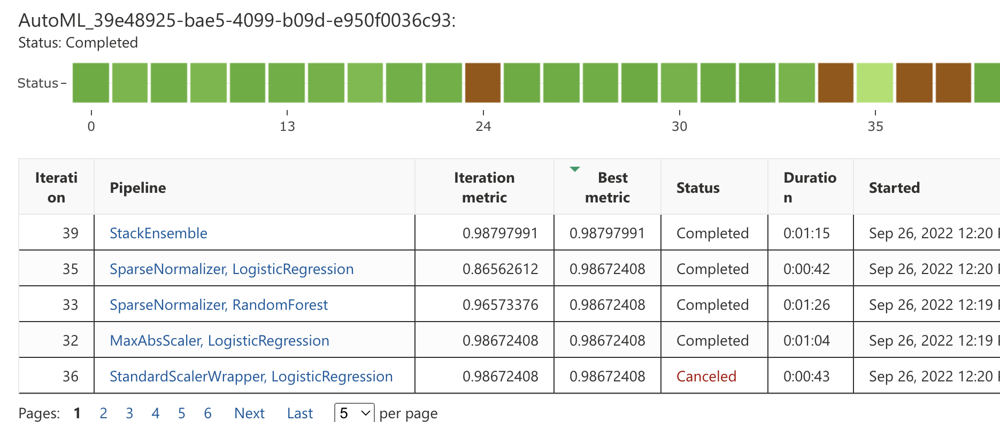

# 1) Project 

### Project Title

Capstone Project - Azure Machine Learning Engineer

### Project Description

- In this project, I utilise my learning from the Udacity Nanodegree
- I create two models:

            - one using AutoML
            - one customized model with hyperparameters tuned using HyperDrive

- I then compare the performance of both the models and deploy the best performing model
- This project demonstrates my ability to use an external dataset in my workspace, train a model using the different tools available in the AzureML framework as well as my ability to deploy the model as a web service

### Set Up and Installation

- First create a workspace in AzureML
- Then create a compute instance depending on budget
- Upload the dataset (csv) file into Datastore and register it with the name "capstone-spam-dataset"
- Upload all files in the project into the Notebooks tab
- Run all cells in "automl.ipynb" and "hyperparameter_tuning.ipynb"

# 2) Dataset

### Overview

We are using a Spam classification dataset obtained from kaggle "spam-ham-dataset.csv"

### Task

- This task is a multi-class text classification problem. Specifically binary text classification since we have only 2 classes - spam and ham
- For AutoML model, features are extracted automatically
- For Hyperdrive model, we are using TF-IDF as features 

### Access

- The data can be accessed from the Datastore using <code>Dataset.get_by_name(ws, name)</code>

# 3) Automated ML

### Settings and Configuration

</img>

### Results

<b>What are the results you got with your automated ML model? What were the parameters of the model?</b>
- Best AutoML model was "Stack Ensemble", with accuracy of 98.79%

<b>How to improve results?</b>
- Dataset was imbalanced, hence balancing that could have given better results
- If we allow Deep Learning models within AutoML, it could lead to better results

</img>

</img>

# 4) Hyperparameter Tuning

<b>What kind of model did you choose for this experiment and why?</b> 
- I chose a Logistic Regression model because I wanted to build a simple baseline model for the Hyperdrive component of this project

<b>Give an overview of the types of parameters and their ranges used for the hyperparameter search</b>
- Its parameters are C and max_iter
- Ranges:

            param_sampling = RandomParameterSampling( {
                        "C": choice(0.01, 0.001, 0.1, 1),
                        "max_iter": choice(50,100),
                        }
            )

### Results
*TODO*: What are the results you got with your model? What were the parameters of the model? How could you have improved it?

*TODO* Remeber to provide screenshots of the `RunDetails` widget as well as a screenshot of the best model trained with it's parameters.

# 5) Model Deployment
*TODO*: Give an overview of the deployed model and instructions on how to query the endpoint with a sample input.

# 6) Screen Recording
*TODO* Provide a link to a screen recording of the project in action. Remember that the screencast should demonstrate:
- A working model
- Demo of the deployed  model
- Demo of a sample request sent to the endpoint and its response

