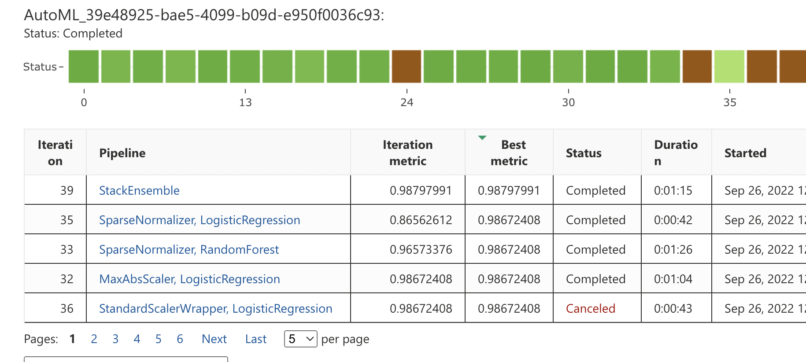

# 1) Project 

### Project Title

Capstone Project - Azure Machine Learning Engineer

### Project Description

- In this project, I utilise my learning from the Udacity Nanodegree
- I create two models:

            - one using AutoML
            - one customized model with hyperparameters tuned using HyperDrive

- I then compare the performance of both the models and deploy the best performing model
- This project demonstrates my ability to use an external dataset in my workspace, train a model using the different tools available in the AzureML framework as well as my ability to deploy the model as a web service

### Set Up and Installation

- First create a workspace in AzureML
- Then create a compute instance depending on budget
- Upload the dataset (csv) file into Datastore and register it with the name "capstone-spam-dataset"
- Upload all files in the project into the Notebooks tab
- Run all cells in "automl.ipynb" and "hyperparameter_tuning.ipynb"

# 2) Dataset

### Overview

We are using a Spam classification dataset obtained from kaggle "spam-ham-dataset.csv"
<a href="https://www.kaggle.com/datasets/team-ai/spam-text-message-classification" target="_blank"> (Find it here) </a>

### Task

- This task is a multi-class text classification problem. Specifically binary text classification since we have only 2 classes - spam and ham
- For AutoML model, features are extracted automatically
- For Hyperdrive model, we are using TF-IDF as features 

### Access

- The data can be accessed from the Datastore using <code>Dataset.get_by_name(ws, name)</code>

# 3) Automated ML

### Settings and Configuration
n_cross_validations: 4
            - We want to perform 4-fold cross validation, i.e. training data is split into 4 folds/groups, 1 group is used as validation set, while the remaining 3 groups are used for training. This is repeated 4 times, with a different group used as a validation set each time

task = "classification" 
            - We are performing multi-class classification, specifically binary classification

label_column_name = "Category" 
            - We want the ML model to predict this column value

experiment_timeout_hours: 0.25 
            - We want the AutoML experiment to run for maximum 15 min

primary_metric: "accuracy"
            - We want to use accuracy as the metric during model training for optimization. 

enable_early_stopping: True
            - We want to enable early termination during the AutoML experiment if the score is not improving in the short term

featurization: 'auto'
            - As part of preprocessing, we want data guardrails and featurization steps to be done automatically

max_concurrent_iterations: 5
            - Number of concurrent child runs allowed for the AutoML experiment

compute_target
            - The compute target on which we want this AutoML experiment to run is specified

training_data = training_dataset
            - training_dataset is passed because it contains the data to be used for training the model

</img>

### Results

<b>What are the results you got with your automated ML model? What were the parameters of the model?</b>
- Best AutoML model was "Stack Ensemble", with accuracy of 98.79%
- Parameters of the best model are shown below: 

</img>

<b>How to improve results?</b>
- Dataset was imbalanced, hence balancing that could have given better results
- If we allow Deep Learning models within AutoML, it could lead to better results

</img>

</img>

# 4) Hyperparameter Tuning

<b>What kind of model did you choose for this experiment and why?</b> 
- I chose a Logistic Regression model because I wanted to build a simple baseline model for the Hyperdrive component of this project

<b>Give an overview of the types of parameters and their ranges used for the hyperparameter search</b>

- Its parameters are C and max_iter
            - C: Inverse of regularization strength; must be a positive float. Smaller values specify stronger regularization
            - max_iter: Maximum number of iterations taken for the solvers to converge

- Ranges:

            "C": choice(0.01, 0.001, 0.1, 1)
            "max_iter": choice(50,100)

### Results

<b>What are the results you got with your model? What were the parameters of the model?</b>
- The best model had accuracy of 96.91%
- Parameters were C=1 and max_iter=50

<b>How could you have improved it?</b>
- Balancing the imbalanced dataset
- Deep Learning models such as BERT, LSTM, etc. could have given better results
- We could have used better feature engineering techniques such as word2vec, doc2vec, transformer-embeddings, etc.
- We can try out other classical ML classification algorithms such as SVM, XGBoost, Random Forest, etc.

</img>

</img>

</img>

# 5) Model Deployment
<b>Give an overview of the deployed model and instructions on how to query the endpoint with a sample input.</b>

- The deployed model was a Stack Ensemble model created in the AutoML experiment, since it gave the best accuracy from all experiments
- First obtain and deploy the best model by running all cells (except last 2 cells - they delete resources) in the "automl.ipynb" notebook
- The "automl.ipynb" notebook contains the code logic to query the deployed endpoint. To test your own input, enter your text in the "Message" field in the data, and run the cell to get back the prediction.

</img>

</img>

# 6) Screen Recording
<b>Provide a link to a screen recording of the project in action. Remember that the screencast should demonstrate:
- A working model
- Demo of the deployed  model
- Demo of a sample request sent to the endpoint and its response
</b>

<a href="https://youtu.be/R4moaIpWWZ4">Click here to view screencast</a>